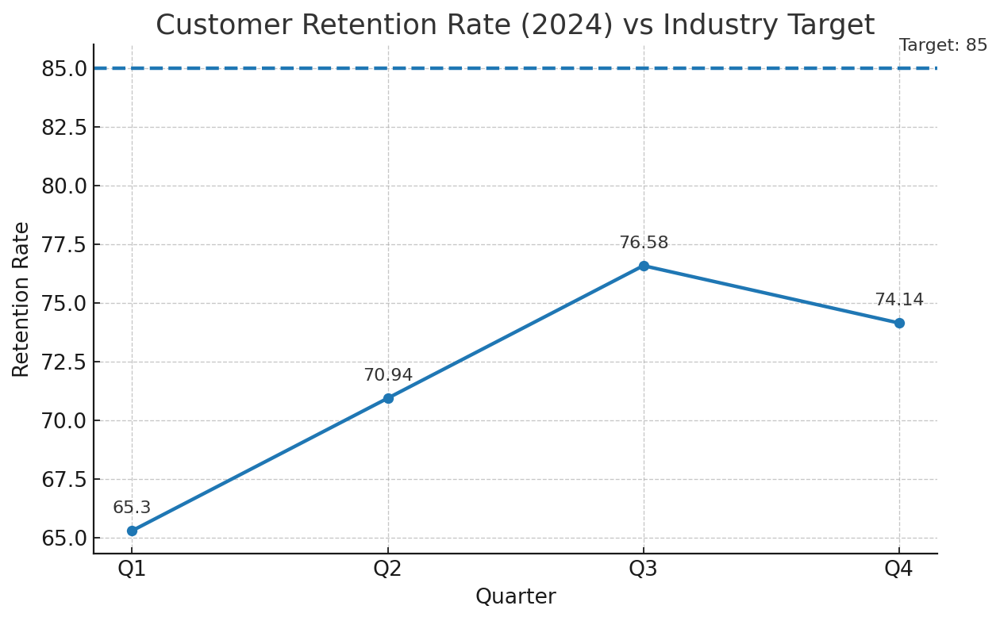

# Supply Chain Correlation Analysis

This repository contains the correlation analysis and visualization for the automotive supplier performance dataset.

- **Email:** 24f2008495@ds.study.iitm.ac.in
- **Files:**
  - `correlation.csv`: Pearson correlation matrix for the 5 key supply chain metrics.
  - `heatmap.png`: Heatmap using a Red–White–Green color scale (low → high correlation).

# E-commerce Performance Analysis: Customer Retention (2024)

**Email (verification): 24f2008495@ds.study.iitm.ac.in**

This pull request adds code and a visualization to analyze our **quarterly customer retention** versus the **industry target**.

## Dataset (2024)
- **Q1**: 65.3  
- **Q2**: 70.94  
- **Q3**: 76.58  
- **Q4**: 74.14  
- **Average**: **71.74**

**Industry Target:** 85

## Key Findings
1. **Retention improved** from **65.3 (Q1)** to **76.58 (Q3)**, before a slight dip to **74.14 (Q4)**.  
2. The **yearly average is 71.74**, which is **13.26 points below** the target of **85**.  
3. The Q2→Q3 acceleration suggests that **tactical initiatives** (e.g., improved onboarding, better personalization, or value messaging) may have worked; however, the **Q4 dip** indicates **persistence/seasonality issues** or **offer fatigue**.

## Business Implications
- The company is **underperforming the benchmark**, implying **higher churn risk** and **greater CAC burden** to replace lost users.
- Sustained gaps to the target can **depress LTV**, **constrain margin**, and **increase marketing spend** to maintain topline growth.
- The partial rebound suggests **retention is tractable** with the correct **journey interventions**.

## Recommendations to Reach 85
**The solution: implement targeted retention campaigns**, specifically:
1. **Lifecycle Segmentation:** Break users by lifecycle stage (new, active, lapsing, churned) and purchase cadence.
2. **Trigger-Based Journeys:** On-site and CRM triggers (email, push, SMS, WhatsApp) for cart abandonment, browsed-but-not-bought, first-purchase nudges, replenishment, and win-back flows.
3. **Value & Trust Messaging:** Emphasize shipping speed, returns, guarantees, and loyalty value; highlight social proof and reviews.
4. **Personalized Offers:** Data-driven discount tiers (A/B tested) and loyalty credits, emphasizing **high-propensity segments** rather than blanket promos.
5. **Post-Purchase Experience:** Proactive delivery updates, easy returns, tailored cross-sell, and service recovery for detractors (NPS < 7).
6. **Onsite UX Fixes:** Reduce friction at checkout, improve search relevance, and streamline account creation.
7. **Measurement Plan:** Weekly retention dashboards, cohort views by acquisition channel, and controlled experiments to isolate lift from each tactic.

## How to Run
```bash
python analysis.py
# Outputs:
#   - retention_trend.png
#   - prints: 'Computed average retention: 71.74'
```

## Visualization
The chart below shows the **quarterly trend** and a **dashed line** for the **industry target**.



## Files in this PR
- `analysis.py` — code to compute stats and produce the visualization
- `retention_trend.png` — generated image
- `README.md` — this data story and instructions
